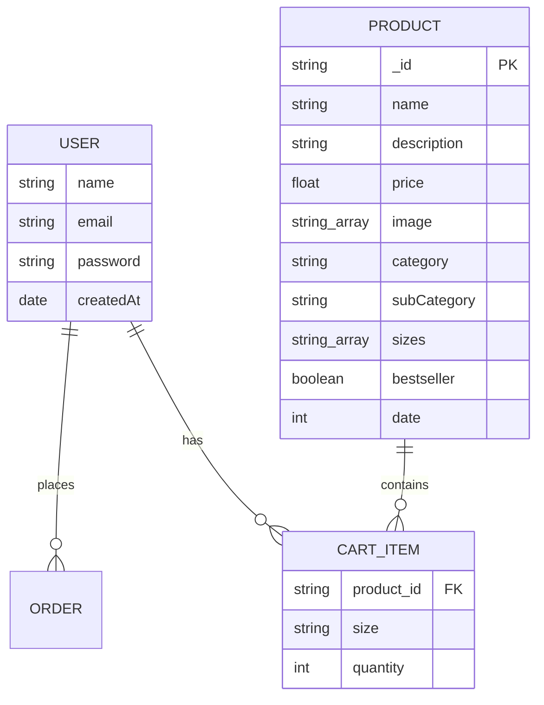

# ER Diagram

```mermaid
erDiagram
    USER ||--o{ ORDER : places
    PRODUCT ||--o{ CART_ITEM : contains
    USER ||--o{ CART_ITEM : has

    USER {
        string name
        string email
        string password
        date createdAt
    }

    PRODUCT {
        string _id PK
        string name
        string description
        float price
        string_array image
        string category
        string subCategory
        string_array sizes
        boolean bestseller
        int date
    }

    %% Note: Cart items are currently handled in client-side localStorage in this implementation
    CART_ITEM {
        string product_id FK
        string size
        int quantity
    }
```
