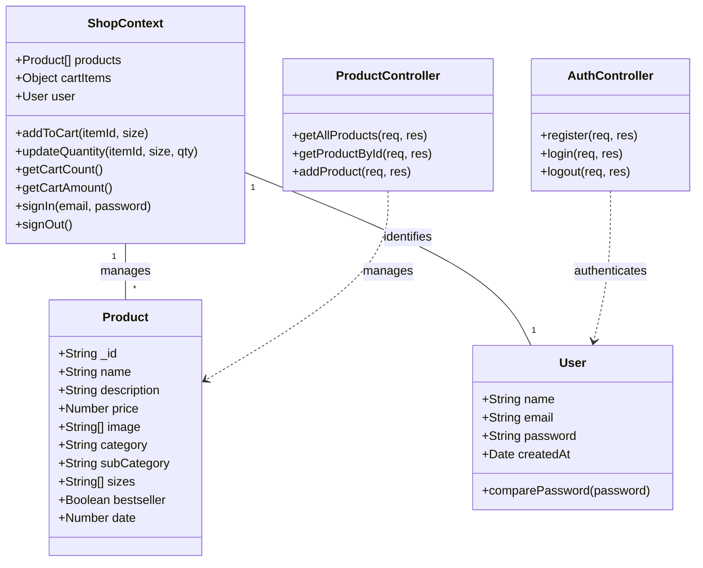

# Class Diagram

```mermaid
classDiagram
    class User {
        +String name
        +String email
        +String password
        +Date createdAt
        +comparePassword(password)
    }

    class Product {
        +String _id
        +String name
        +String description
        +Number price
        +String[] image
        +String category
        +String subCategory
        +String[] sizes
        +Boolean bestseller
        +Number date
    }

    class ShopContext {
        +Product[] products
        +Object cartItems
        +User user
        +addToCart(itemId, size)
        +updateQuantity(itemId, size, qty)
        +getCartCount()
        +getCartAmount()
        +signIn(email, password)
        +signOut()
    }

    class AuthController {
        +register(req, res)
        +login(req, res)
        +logout(req, res)
    }

    class ProductController {
        +getAllProducts(req, res)
        +getProductById(req, res)
        +addProduct(req, res)
    }

    ShopContext "1" -- "*" Product : manages
    ShopContext "1" -- "1" User : identifies
    AuthController ..> User : authenticates
    ProductController ..> Product : manages
```
