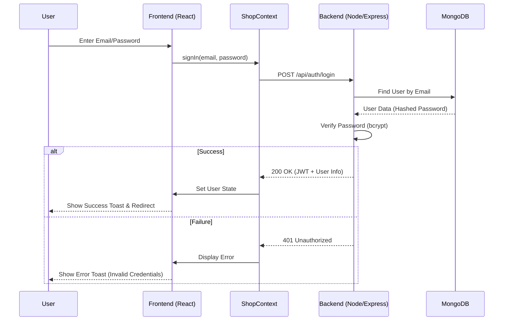

# Sequence Diagram: User Authentication Flow

```mermaid
sequenceDiagram
    participant U as User
    participant F as Frontend (React)
    participant SC as ShopContext
    participant B as Backend (Node/Express)
    participant DB as MongoDB

    U->>F: Enter Email/Password
    F->>SC: signIn(email, password)
    SC->>B: POST /api/auth/login
    B->>DB: Find User by Email
    DB-->>B: User Data (Hashed Password)
    B->>B: Verify Password (bcrypt)
    alt Success
        B-->>SC: 200 OK (JWT + User Info)
        SC->>F: Set User State
        F-->>U: Show Success Toast & Redirect
    else Failure
        B-->>SC: 401 Unauthorized
        SC->>F: Display Error
        F-->>U: Show Error Toast (Invalid Credentials)
    end
```
